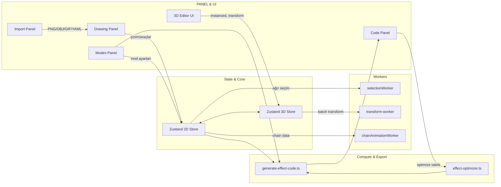

## AuraFX — MythicMobs Effect Generator (Open Source)

AuraFX is a visual effect editor that generates MythicMobs YAML from 2D/3D compositions. It includes a fast 2D editor, an optional 3D workspace, animation modes, PNG/GIF/OBJ/YAML importers, and an export pipeline tuned for real servers.

Important
- Open source: This repository is now open source.
- Maintenance mode: No new features planned by the author. Community PRs for fixes and small improvements are welcome.

### Live demo and links
- Website: https://aurafx.online
- GitHub: https://github.com/sleepsweetly/AuraFX

### 1. Architecture Overview

- **Tech Stack**
  - Next.js 15 (App Router), React 18, TypeScript 5
  - 3D: three.js 0.177, @react-three/fiber, @react-three/drei, @react-three/xr
  - 2D: HTML Canvas; optional Pixi (`@inlet/react-pixi`)
  - State: Zustand 5 (+ subscribeWithSelector, immer)
  - UI: TailwindCSS 3.3, shadcn/ui (Radix), framer-motion, lucide-react
  - Media/Import: OpenCV.js, gifuct-js, js-yaml, density-clustering (types)
  - Analytics: Vercel Analytics/Speed Insights, Google Analytics

- **Katmanlar ve Sorumluluklar**
  - `components/` ve `app/components` (UI): Paneller, mod ayarları, çizim araçları, önizleme; alt klasörler: `components/panels/` (Drawing, Modes, Preview, Code), `components/ui/` (shadcn/Radix tabanlı UI), `components/import-panel.tsx` (PNG/OBJ/GIF/YAML içe aktarma arayüzü)
  - `components/canvas.tsx`: 2D editörün ana Canvas mantığı (çizim, seçim, dönüşüm, 3D projeksiyon varyantı)
  - `app/3d/`: 3D editör (scene, instanced render, transform controls, seçim kutusu)
  - `app/generate-effect-code.ts`: MythicMobs için YAML kodu üretimi; animasyon modlarının zaman/konum/renk hesapları
  - `worker/`: Ağır hesaplamalar (transform, chain animasyonu, seçim kutusu) için Web Worker’lar
  - `lib/effect-optimizer.ts`: Etki kodu sıkıştırma/örnekleme/optimizasyon yardımcısı
  - `store/` ve `app/3d/store/`: 2D/3D editör state’leri, batch işlemler, geçmiş yönetimi

- **Sistem Genel Akış Diyagramı**

#### Diyagram Kısaltmaları (Legend)

- **DP (Drawing Panel)**: 2D çizim paneli (çember/çizgi/serbest çizim, seçim/dönüşüm). `components/canvas.tsx`, `components/panels/drawing-panel.tsx`
- **MP (Modes Panel)**: Mod ayarları (global/yerel rotasyon, hareket, gökkuşağı, chain). `components/panels/modes-panel.tsx`
- **IP (Import Panel)**: PNG/OBJ/GIF/YAML içe aktarma. `components/import-panel.tsx`
- **CP (Code Panel)**: Üretilen MythicMobs YAML kodunun görüntülenmesi/indirilmesi/optimizasyonu. `components/panels/code-panel.tsx`
- **P3D (3D Editor UI)**: 3D sahne, instanced render, transform controls, seçim kutusu, zoom. `app/3d/components/*`

- **S2D (Zustand 2D Store)**: 2D editör durum verisi (katman/eleman/seçim). `store/useElementStore.ts`, `store/useLayerStore.ts`
- **S3D (Zustand 3D Store)**: 3D editör durumu (Map tabanlı vertex/shape, batch ops, history). `app/3d/store/use3DStore.ts`

- **Wsel (selectionWorker)**: Kutu-seçim hesaplarını hızlıca worker’da yapar. `worker/selectionWorker.ts`
- **Wtf (transform-worker)**: Çoklu vertex dönüşümlerini (rotate/scale/translate) toplu hesaplar. `worker/transform-worker.ts`
- **Wchain (chainAnimationWorker)**: Chain modunun zamanlama/pulse verisini üretir. `worker/chainAnimationWorker.ts`

- **GEN (generate-effect-code)**: Katman+modlardan MythicMobs YAML üretir. `app/generate-effect-code.ts`
- **OPT (effect-optimizer)**: Satır azaltma/örnekleme/birleştirme/interval artırma. `lib/effect-optimizer.ts`

Okların anlamı (akış):
- S2D — ağır seçim → Wsel: 2D’de yoğun kutu-seçim hesapları worker’a devredilir.
- S3D — batch transform → Wtf: 3D toplu transform hesapları worker’da yapılır.
- S2D — chain data → Wchain: Zincir animasyonu verileri worker’a aktarılır.
- S2D & MP → GEN: 2D durum + mod ayarları kod üreticiyi besler.
- GEN → CP: Üretilen YAML, Code Panel’de gösterilir.
- CP — optimize talebi → OPT → GEN: Optimize isteği optimizer’a gider; yeniden üretim yapılır.

##### Akışın Detaylı Anlatımı (Sadeleştirilmiş)

1) Kullanıcı UI (DP/MP/IP/CP/P3D) ile etkileşir. Çizimler/ayarlar, ilgili store’lara (S2D/S3D) yazılır.
2) Ağır hesap gerektiren işler (kutu-seçim, toplu transform, chain zamanlaması) UI’ı kilitlememek için Worker’lara (Wsel/Wtf/Wchain) taşınır ve sonuçlar store’lara geri döner.
3) Kod üretmek istendiğinde, S2D’deki katman/eleman + MP’deki mod ayarları birlikte **GEN**’e gider ve MythicMobs uyumlu YAML satırları oluşturulur.
4) Kod, **CP** üzerinde gösterilir. Kullanıcı isterse **OPT** ile örnekleme/birleştirme/interval artırma uygulanır ve **GEN** yeniden çağrılarak daha kısa/akıcı kod üretilir.
5) 2D ve 3D editörler karşılıklı içe/dışa aktarma ile senkronize olabilir (ör. 2D’de çizilen noktalar S3D’ye vertex olarak taşınır).

##### Örnek Senaryo (Uçtan Uca)

- IP’de bir PNG dosyası içe aktarılır; OpenCV ile kenarlar/skeleton çıkarılıp S2D’ye elementler eklenir.
- DP’de daire aracıyla ek noktalar çizilir; MP’den Global Rotation ve Dynamic Rainbow açılır.
- GEN çağrılır; döngüsel açılar ve HSV→RGB hesaplarıyla YAML satırları üretilir; CP’de görünür.
- CP’den “Optimize” tıklanır; OPT grid/step örnekleme ile element sayısını azaltır, interval’leri dengeler; GEN yeniden çalışır, satır sayısı düşer.
- İstenirse S2D → S3D aktarılır; P3D üzerinde Transform Controls ile toplu döndürme yapılır (Wtf çalışır), sahne akıcı kalır.

### 2. Feature List

- **2D Editor (Canvas)**
  - Draw/transform/select shapes and points, chain recording, quick settings
  - Files: `components/canvas.tsx`, `components/panels/drawing-panel.tsx`
  - **Bağlantılar**: Mod panelleri (renk, modlar), Import Panel (PNG/OBJ/GIF/YAML), Code Panel (kod üretim/indirme)

- **3D Editor**
  - Instanced rendering, selection box, transform controls, zoom
  - Files: `app/3d/components/Scene3DEditor.tsx`, `OptimizedScene3D.tsx`, `TransformControlsManager.tsx`, `SelectionBox.tsx`, `ZoomControls.tsx`
  - **Bağlantılar**: `app/3d/store/use3DStore.ts` (Map tabanlı vertex depolama), 2D ile karşılıklı import/export

- **İçe Aktarım (PNG/OBJ/GIF/YAML)**
  - **Amaç**: Harici veriyi parçacık noktalarına dönüştürmek
  - **Dosyalar**: `components/import-panel.tsx`
  - **Öne Çıkanlar**: OpenCV (kılcal çizgi/skeleton, Canny kenar), gifuct-js (frame açılımı), YAML parse (MythicMobs scriptlerinden konum/renk çıkarımı)

- **Modlar ve Animasyonlar**
  - **Amaç**: Global/yerel rotasyon, hareket, dinamik/ statik gökkuşağı gibi görsel hareketlerin otomatik uygulanması
  - **Dosyalar**: `components/panels/modes-panel.tsx`, `app/generate-effect-code.ts`

- **MythicMobs YAML Kod Üretimi**
  - **Amaç**: 2D/3D editördeki katman ve elemanlardan oyun içi efekt komutları üretmek
  - **Dosya**: `app/generate-effect-code.ts`
  - **Bağlantılar**: Discord webhook (analitik), `lib/effect-optimizer.ts` (isteğe bağlı yoğunluk/örnekleme)

- **Performans Aracı (Optimizer)**
  - **Amaç**: Satır sayısını azaltmak, elementleri örneklemek, interval’leri büyütmek
  - **Dosyalar**: `lib/effect-optimizer.ts`, `components/performance-optimizer.tsx`

- **Web Worker Entegrasyonları**
  - **Amaç**: Seçim kutusu hesapları, toplu dönüşümler ve zincir animasyonu gibi görevleri ana iş parçacığından ayırmak
  - **Dosyalar**: `worker/transform-worker.ts`, `worker/selectionWorker.ts`, `worker/chainAnimationWorker.ts`

- **Instanced Rendering ve LOD**
  - **Amaç**: Çok sayıda parçacığı GPU üzerinde verimli çizmek; uzak öğeleri basitleştirmek
  - **Dosyalar**: `app/3d/components/Scene3DEditor.tsx` (InstancedMesh), `components/lod-system.tsx`

### 3. Matematiksel Formüller ve Hesaplamalar

Bu bölüm, projede doğrudan kullanılan matematiksel işlemleri ve bunların kaynaklarını özetler.

- **Düzlemde Daire (2D)**
  - Nokta i için parametre: θᵢ = 2π·i/N
  - Konum: x = r·cos(θᵢ), z = r·sin(θᵢ)
  - Kod: `components/canvas.tsx` (çember çizimi), `use3DStore.generateShapeVertices(circle)`

- **Küre Üzerinde Dağıtım (Fibonacci Sphere)**
  - Altın oran: ϕ = (1 + √5)/2, artımsal açı: Δ = 2π/ϕ
  - t = i/N; eğim (inclination): ι = arccos(1 − 2t), azimut: α = Δ·i
  - Konum: 
    - x = r·sin(ι)·cos(α)
    - y = r·cos(ι)
    - z = r·sin(ι)·sin(α)
  - Kod: `use3DStore.generateShapeVertices(sphere)`

- **Euler Dönüşleri (X→Y→Z sıralı)**
  - X etrafında: y' = y·cosx − z·sinx, z' = y·sinx + z·cosx
  - Y etrafında: x'' = x'·cosy + z'·siny, z'' = −x'·siny + z'·cosy
  - Z etrafında: x''' = x''·cosz − y''·sinz, y''' = x''·sinz + y''·cosz
  - Kod: `use3DStore.generateShapeVertices(...)` ve `TransformControlsManager.tsx`
  - Not: 3D dönüşümlerde Euler kullanılıyor; quaternion henüz kullanılmıyor (bkz. öneriler)

- **Perspektif Projeksiyon (2D Canvas önizleme)**
  - `components/canvas.tsx` içinde kullanılan form:
    - Döndürme: x,y,z değerleri önce rotasyonlarla güncellenir (Euler)
    - Perspektif ölçek: s = fov/(fov + z₂)
    - Ekran: X = cx + s·x₁, Y = cy + s·y₁

- **Global Rotasyon Modu**
  - Global merkez C = (0,0), yarıçap r = √((x−Cx)² + (z−Cz)²)
  - Açı: θ(t) = 2π·t/Frames
  - Yeni konum: x' = Cx + r·cos(θ₀+θ), z' = Cz + r·sin(θ₀+θ), y sabit (+ diğer modlardan offset)
  - Kod: `generate-effect-code.ts` (ana döngü)

- **Yerel Rotasyon (Self Rotation)**
  - Her eleman için kendi merkezinde: x' = cx + r·cos(ωt), z' = cz + r·sin(ωt)
  - Kod: `generate-effect-code.ts` (localRotateMode)

- **Hareket Modu (Direction/Elevation)**
  - Yön: dir ∈ {−1..7}, açı: θ = (dir/8)·2π + π/2 (−1 ise yatay yok)
  - Eğim: φ = (elevation/90)·(π/2)
  - İlerleme: d(t) = min(t·speed, maxDistance)
  - Öteleme: Δx = cosθ·cosφ·d, Δz = sinθ·cosφ·d, Δy = sinφ·d

- **Renk (HSV→RGB) ve Gökkuşağı**
  - `hsvToRgb(h,s,v)` içinde sektör temelli dönüşüm
  - Dinamik gökkuşağı: hue(t) = (t/period) mod 1; statik gökkuşağı: hue(i) = i/(N−1)
  - Kod: `app/generate-effect-code.ts`

- **Çember Optimizasyonu (Ring tespiti)**
  - Merkez: (x̄, z̄) = ortalama konum
  - Yarıçap kestirimi: r ≈ ortalama(√((x−x̄)² + (z−z̄)²))
  - Standart sapma ile çemberlik doğrulaması, eşik rσ < 0.2·r
  - Kod: `generate-effect-code.ts` optimize bloğu

- **Skeletonization ve Kenar Tabanlı Örnekleme (PNG)**
  - Zhang–Suen inceletme (iki aşamalı yok etme, 8-komşuluk, geçiş sayısı vb.)
  - Canny kenar: threshold’lar ile edge matrisinden örnekleme
  - Grid örnekleme: dünya koordinatına yuvarlayıp hücre başına tek örnek
  - Kod: `components/import-panel.tsx`

- **GIF Çözümleme ve Örnekleme**
  - Frame’ler gifuct-js ile çıkartılır; her piksel aday; limit üzeri ise eşit aralıklı deterministik örnekleme (idx = ⌊i·C/Max⌋)
  - Kod: `components/import-panel.tsx` (extractElementsFromFrame)

- **Seçim Karesi ve Görünürlük (3D)**
  - Ekran uzayına projekt: `Vector3.project(camera)`
  - Adayları uzaklığa göre sırala; yakın vertex’in komşuyu perdelemesi için mesafe eşiği; X-Ray modunda perdelenme yok
  - Kod: `app/3d/components/SelectionBox.tsx`

- **Transform Worker (Toplu Dönüşüm)**
  - Y ekseni etrafında rotasyon: x' = x·cosθ − z·sinθ; z' = x·sinθ + z·cosθ
  - Ölçek ve öteleme sırayla uygulanır
  - Kod: `worker/transform-worker.ts`

- **Zincir Animasyon (Pulse)**
  - Faz: ϕ = (t − delayᵢ) mod (2·T)
  - Yoğunluk: I = 0.5·(sin(π·ϕ/T) + 1) (0..1 normalizasyon)
  - Kod: `worker/chainAnimationWorker.ts`

### 4. Optimizasyon Teknikleri

- **GPU Instanced Rendering**
  - `InstancedMesh` ile binlerce noktanın tek draw call ile çizimi; `instanceMatrix` ve `instanceColor` güncellemesi
  - Dosyalar: `Scene3DEditor.tsx`, `OptimizedScene3D.tsx`

- **Seçim ve Dönüşümler İçin Web Worker**
  - `selectionWorker.ts`: ekran uzayı/box seçim hesapları
  - `transform-worker.ts`: toplu dönüşüm (cos/sin ön hesap, tek matris döngüsü)
  - `chainAnimationWorker.ts`: zincir animasyon zamanlaması

- **Batch/Throttle**
  - `requestIdleCallback`/batch boyutuyla büyük vertex güncellemelerinde ana thread’i bloklamama (`use3DStore.updateVerticesBatch`)
  - 2D canvas güncellemelerinde 16ms throttle, kirli-bayrak (dirty set) yaklaşımı (`components/optimized-canvas.tsx`)

- **LOD ve dpr Kontrolü**
  - Kamera mesafesine göre detay (
    high/medium/low), uzaklar instanced/low poly
  - `Canvas` dpr: performans modunda [0.5, 1]

- **Kod Üretimi Optimizasyonu**
  - Çember tespiti ile çoklu `e:p` yerine tek `particlering{points, radius}` satırı
  - `effect-optimizer.ts`: grid/step/random/center örnekleme; interval yükseltme; benzer efektleri birleştirme

- **OpenCV yol optimizasyonları**
  - Morfolojik açma/kapama ile gürültü bastırma; isteğe bağlı skeleton (inceletme)
  - Kademeli örnekleme: önce adaylar, sonra limit aşımında deterministik seyreltme

### 5. Kod Tasarım Kararları

- **Zustand + Map tabanlı Store**
  - Vertex erişimleri O(1); büyük sahnelerde seçme/ekleme/silme hızlı
  - `immer` ile kontrollü mutasyon; `subscribeWithSelector` ile seçili dilimin re-render’ını sınırlama

- **2D ve 3D Editörlerin Ayrışması**
  - 2D hızlı çizim/şekil üretim; 3D yüksek hacimli render/transform
  - Karşılıklı import/export fonksiyonları ile senkronizasyon (`use3DStore.exportToMainSystem`, `importFromMainSystem`)

- **Modüler İçe Aktarım**
  - PNG/OBJ/GIF/YAML ayrı akışlar, tek panelden yönetim; OpenCV/gifuct-js arayüz soyutlaması

- **Basit ve Açık Matematik (Euler)**
  - UI’da eksenel rotasyonların anlaşılabilirliği için Euler; three.js ile hizalı
  - Alternatif: quaternion (daha kararlı birleşik rotasyonlar), önerilerde yer alır

- **Kullanıcı Deneyimi**
  - shadcn/ui + Tailwind ile tutarlı modern UI; framer-motion ile düşük maliyetli animasyon
  - Büyük dataset’lerde otomatik performans modu bildirimi

### 6. Eksikler ve İyileştirme Önerileri

- **Güvenlik & Konfigürasyon**
  - Discord webhook URL’leri projede *hardcode* edilmiş (`app/generate-effect-code.ts`).
    - Öneri: `.env` kullanın; server-side proxy ile istek yapın; CORS ve rate-limit ekleyin.

- **Next Config & Dağıtım**
  - `next.config.mjs` içinde `output: 'export'` yorumu var; SSR özellikleri/worker yol çözümleriyle çakışabilir.
    - Öneri: Deploy stratejisini netleştirip gereksiz ayarı kaldırın ya da SSG hedefini bilinçli kullanın.

- **GIF/PNG İçeriği ve Bellek**
  - Varsayılan limitler yüksek (örn. GIF frame başına on binlerce aday). Büyük dosyalarda bellek/GC baskısı olur.
    - Öneri: Maks element/çözünürlük dinamik limitleme, **OffscreenCanvas** ve **Web Worker** ile piksel taramasını tamamen arka plana taşıma; kademeli/önizlemeli içe aktarma.

- **3D Matematik**
  - Euler yerine **Quaternion** tabanlı birleşik rotasyon (gimbal lock riskini azaltır) – özellikle `TransformControlsManager` ve `generateShapeVertices` için.

- **Seçim & Görünürlük**
  - Seçim kutusunda görünürlük heuristiği basit; karmaşık mesh komşuluklarında hata payı olabilir.
    - Öneri: Z-buffer türevi raycast ile gerçek perdeleme; ya da three.js `Raycaster`’ı instanced veriyle hibrit kullanma.

- **Kod Üretiminde Türetilmiş Primitifler**
  - Çember optimizasyonu var; benzer şekilde çizgiler için uçtan uca `particleline_direct` benzeri birleştirme planı yorumda bırakılmış
    - Öneri: Gruplu doğrular, yaylar, spiral primitive’leri otomatik tanıma/parametreleştirme.

- **WebGL Tabanlı 2D**
  - Yoğun 2D çizimlerde Canvas CPU-sınırlı kalabilir.
    - Öneri: `PixiCanvas` (mevcut) veya WebGL `Points` shader ile önizleme.

- **Genel Kod Sağlığı**
  - `console.log` çıktıları çok; prod profilde susturma.
  - Window globaline atamalar (`window._zoomCamera`, `window.addPngElements` vs.) – modüler event bus/API ile soyutlayın.
  - Tip güvenliği: bazı `any` alanları daraltılabilir; `types/index.ts` genişletilip yeniden kullanılabilirlik artırılmalı.

### Dosya Bazlı Kısa Derin Dalışlar

- `app/generate-effect-code.ts`
  - Katman/elemanlardan YAML üreten çekirdek. Modlara göre frame sayısı, renk (HSV→RGB), hareket/rotasyon (trigonometrik) hesaplar. Çember tespiti ile satır azaltır.

- `components/canvas.tsx`
  - 2D çizim ve seçim; 3D görünüm benzetimi için Euler rotasyon + perspektif projeksiyon uygulanır. Zincir moda kayıt ve eraser alan hesapları içerir.

- `app/3d/store/use3DStore.ts`
  - Vertex’ler Map ile tutulur; batch güncellemeler, geçmiş, performans modu, toplu dönüşümlerin tek seferde uygulanması (`applyTempTransforms`). Şekil vertex’leri dönüşümlerde tekrar üretilir (pozisyon/rotasyon/ölçek etkisi).

- `worker/transform-worker.ts`
  - cos/sin ön hesap ile O(N) döngüde rotasyon+ölçek+öteleme. Büyük setlerde ana thread’i bloke etmeden dönüşüm.

- `components/import-panel.tsx`
  - OpenCV ile skeleton/kenar, grid/pixel örnekleme, gifuct-js frame çözümleri. Eşikler (alpha/color toleransı) ve deterministik örnekleme sayesinde form korunur.

- `lib/effect-optimizer.ts`
  - Satır analizi, benzer efektlerin birleşimi, interval büyütme, akıllı örnekleme (grid/step/random/center). Kod üreticiyle birlikte kullanıldığında satır sayısını kayda değer düşürür.

### Ekler

- **Önemli Bağımlılıklar**: three, @react-three/fiber, @react-three/drei, gifuct-js, js-yaml, OpenCV.js (CDN), zustand, framer-motion, tailwindcss
- **Analitik/SEO**: Vercel Analytics, Speed Insights, yapılandırılmış veri (Schema.org), GA consent modu
- **PWA/Offline**: (Mevcut kodda PWA yapılandırması görünmüyor; ihtiyaç varsa `next-pwa` vb. ile eklenmeli)

### Final Notes

AuraFX provides a practical pipeline to design effects visually and export MythicMobs YAML. It is open source and in maintenance mode (no further feature development by the author). Feel free to fork, study, and adapt it.

